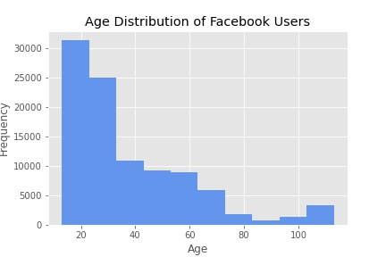
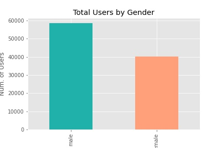
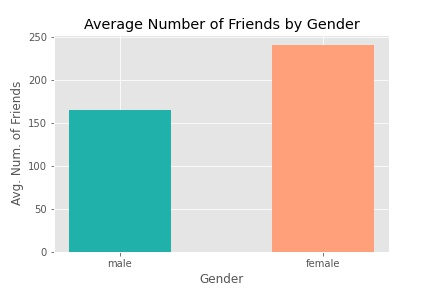
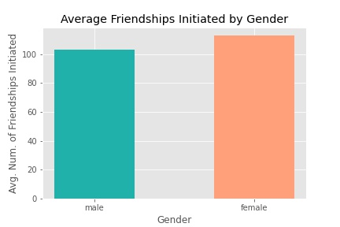

# Predicting Facebook Users' Gender

# Motivation
There are roughly 2.9 billion active users on Facebook in the second quarter of 2021 with the number of active users still steadily increasing. The purpose of this project sought to identify whether there are telltale signs pointing to gender based on various social metrics and other online behavorial metrics. 

Facebook users of different genders display various online behaviors based off of social metrics. 

# Data Description

## Source

Facebook Data by Sheena Batra

[Facebook Data](https://www.kaggle.com/sheenabatra/facebook-data)
The dataset is in csv format, obtained from kaggle.

## Features

This dataset contains 99903 entries with 15 columns.

Columns: 

- userid
- age
- DOB day
- DOB month
- DOB year
- gender
- tenure
- friend count
- friendships initiated
- likes
- likes received
- mobile likes
- mobile likes received
- www likes
- www likes received

# Exploratory Data Analysis
The distribution of user age show a significantly greater number of younger individuals using the social platform. With most of the users under 30 years old.

[figure description]

There seems to a generally balanced distribution of genders with there being slightly more male users in this data.

[figure description]

[figure description]

# Modeling
With the target set as a binary classfication in for modeling, a baseline of random choice would yield 50% accuracy. 
Logistic regression and Random Forests Classification models were implemented   

# Results

# Discussion
